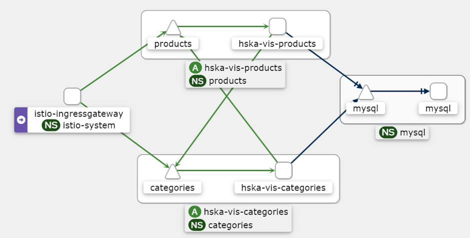

# Install mysql

Create the namespace if not already exists

```bash
kubectl create ns mysql
```

```bash
cd mysql/
helm3 upgrade --install -n mysql mysql .
```

Because of the persistent volume it may not be enough to just uninstall the helm chart if any changes to the database is made. To get a fresh install first uninstall the helm chart and then delete the persistent volume on the disk. Maybe this can somehow be avoided with `persistentVolumeReclaimPolicy: Reclaim`.

```bash
helm3 uninstall -n mysql mysql

cd /mnt/k8s/
sudo rm -r mysql
```

## Secret

```bash
kubectl create secret generic -n mysql mysql-credentials --from-literal=MYSQL_ROOT_PASSWORD='c8de110f37300a53a971749'
```

## Start Cluster

```bash
minkube start
```

## Open Dashboard

```bash
minikube dashboard --url
```

## Local images

To be able to use docker images in kubernetes they must be pushed to a registry. Microk8s provides a registry addon (Minikube seems to also have on). Docker images can be pushed to this registry. By tagging the image with `localhost:32000/`, Kubernetes tries to pull the image from this build-in registry.

```bash
microk8s enable registry

docker build -t localhost:32000/hska-vis-mysql:0.1.0 -f docker/DockerfileMySQL .
docker push localhost:32000/hska-vis-mysql:0.1.0
```

## Istio installieren:
```bash
istio-1.22.0-win.zip von https://github.com/istio/istio/releases/tag/1.22.0 installieren
path=%path%;<istio-1.22.0-Pfad>\bin
istioctl install
kubectl label namespace categories istio-injection=enabled
kubectl label namespace products istio-injection=enabled

Alle Categories und Products Pods/Service löschen (z.B. im Dashboard) und neu erstellen mit 
helm upgrade --install -n categories categories .
helm upgrade --install -n products products .
im entsprechenden Ordner hska-vis-categories/products

Überprüfen ob Istio aktiv:
kubectl --namespace=categories get pod
kubectl --namespace=products get pod
Bei allen Pods muss 2/2 stehen, nicht mehr 1/1
```

## AddOns Installieren:
```bash
kubectl apply -f istio-1.22.0\samples\addons
minikube tunnel ab jetzt laufen lassen
```

## Kiali:
```bash
kubectl port-forward svc/kiali -n istio-system 20001
aufrufen unter 127.0.0.1:20001

> Traffic Graph, dann Postman Journey durchklicken, Graph entsteht
```


## Prometheus:
```bash
kubectl port-forward svc/prometheus -n istio-system 9090
aufrufen unter 127.0.0.1:9090
evtl. downloaden https://prometheus.io/download/#prometheus

Test-Query: istio_requests_total{destination_service="products.products.svc.cluster.local"}
Products-Microservice mit Postman aufrufen
```

## Grafana:
```bash
aufrufen unter 127.0.0.1:3000
evtl. vorher downloaden https://grafana.com/grafana/download

Benutzerdaten: admin, admin
Dashboards > Create Dashboard > Add Visualization > Configure a new data source > Prometheus > Connection=http://127.0.0.1:9090 > Save & test

Test-PromML-Query (auf Code umstellen)
histogram_quantile(0.95, sum(rate(istio_request_duration_seconds_bucket{destination_service="products.your-namespace.svc.cluster.local"}[5m])) by (le))
Products-Microservice mit Postman aufrufen
```